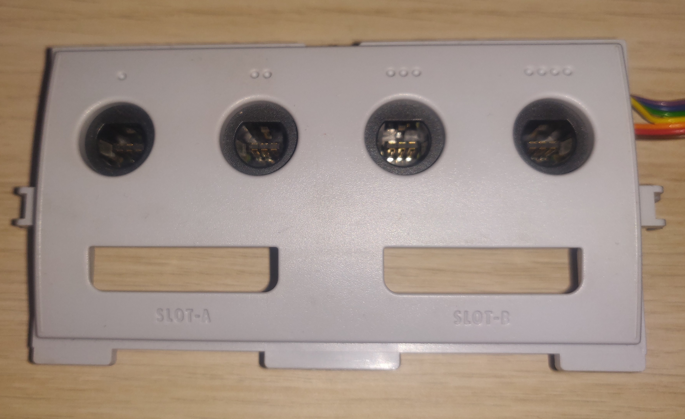

# gcJoy

This project allows one to connect a GameCube controller to PC as a regular joystick. 

An arduino is used to interface with the controller and send information back to the PC through a serial connection. Running on the PC is software that reads this information and emulates a joystick using vJoy

# Setup
1. Connect Arduino to controller as described in [Components](#components)
1. Program Arduino with code from _Arduino/gcJoy/gcJoy.ino_ 
1. Install [vJoy](https://sourceforge.net/projects/vjoystick/)
1. Add the number of controllers you want to connect in the _Configure vJoy_ program by clicking _Add device
1. Run _gcJoy.exe_ which can be found under Releases or built from _csharp/gcJoy.sln_

# The GameCube controller protocol

A more detailed description of the protocol can be found [here](http://www.int03.co.uk/crema/hardware/gamecube/gc-control.html), the tables and images used here are taken from the there.

The pinout of the controller port is given below.

|Pin|Colour |J1 |Function                                                               |
|---|-------|---|-----------------------------------------------------------------------|
| 1 | Yellow| 2 | 5V power supply (used by rumble motor).                               |
| 2 | Red   | 3 | DATA line: bi-directional data to/from console, pull-up to 3.43V      |
| 3 | Green | 4 | Ground.                                                               |
| 4 | White | 5 | Ground                                                                |
| 5 | -     | - | No connection.                                                        |
| 6 | Blue  | 1 | 3.43V logic supply.                                                   |
| 7 | Black | 6 | Cable shielding / ground. Usually common ground with pin 3.           |

The table above shows the number of each pin as shown in the image, the color of its wire in the cable, the pinout number inside the controller and the function of the corresponding pin.

## Serial data interface

The controller communicates through pin 2 at 3.43v. It transfers data at 4 microseconds(us) per bit, where a 0 bit is denoted by 3us low, 1us high and a 1 bit by 1us low, 3us high.

When the controller is sent a specific 24 bit string, it replies with 64 bits of button state and joystick data. 

When a string of bits is sent to or from the controller it always ends with one high stop bit (1). So 0000 becomes 00001.

## Probing the controller

With no controller attached, the gamecube probes for a controller by sending the sequence 000000001 about every 12ms. When you connect a controller it responds to this sequence.

## Polling the controller for data

With a controller attached, the gamecube waits about 6ms between updates. To poll the controller for data the console sends a 24 bit string:

`0100 0000 0000 0011 0000 0010`

The controller then responds with 64 bits of data:
<table border="1" bordercolorlight="#FFFFFF" bordercolordark="#FFFFFF" bordercolor="#FFFFFF">
    <tr>
        <td align="center"><b>Byte 0</b></td>
        <td align="center">0</td><td align="center">0</td>
        <td align="center">0</td><td align="center">Start</td>
        <td align="center">Y</td><td align="center">X</td>
        <td align="center">B</td><td align="center">A</td>
    </tr>
    <tr>
        <td align="center"><b>Byte 1</b></td>
        <td align="center">1</td><td align="center">L</td>
        <td align="center">R</td><td align="center">Z</td>
        <td align="center">D-Up</td><td align="center">D-Down</td>
        <td align="center">D-Right</td><td align="center">D-Left</td>
    </tr>
    <tr>
        <td align="center"><b>Byte 2</b></td>
        <td align="left" colspan="8">&nbsp; Joystick X Value (8 bit)</td>
    </tr>
    <tr>
        <td align="center"><b>Byte 3</b></td>
        <td align="left" colspan="8">&nbsp; Joystick Y Value (8 bit)</td>
    </tr>
    <tr>
        <td align="center"><b>Byte 4</b></td>
        <td align="left" colspan="8">&nbsp; C-Stick X Value (8 bit)</td>
    </tr>
    <tr>
        <td align="center"><b>Byte 5</b></td>
        <td align="left" colspan="8">&nbsp;C-Stick Y Value (8 bit)</td>
    </tr>
    <tr>
        <td align="center"><b>Byte 6</b></td>
        <td align="left" colspan="8">&nbsp; Left Button Value (8 bit)</td>
    </tr>
    <tr>
        <td align="center"><b>Byte 7</b></td>
        <td align="left" colspan="8">&nbsp; Right Button Value (8 bit)</td>
    </tr>
</table>

# Components

To connect the controller to the arduino you need to connect the wires of the controller to arduino pins.

One option is to cut the controller cable and connect the wires directly, but if you want to preserve the cable you need a female gamecube port. A port can be ordered online or taken from the front panel of a GameCube. In my case I took the whole front panel off and soldered wires to probe points on the circuit board.

  
   

I used an Arduino Uno clone (Wavgat Uno) because it has a 3.3v pin which the 3.43v from the controllers could be connected to. The 3.43v, 5v and ground should be connected to the corresponding pins on the Arduino. Data lines for each of the controller ports should be connected to pins 8, 9, 10 and 11 (this can be changed in the arduino code). Also each data pin should be pulled up to 3.3v with a 1k ohm resistor.

 

 
 

# References
1. [The original document referenced](http://www.int03.co.uk/crema/hardware/gamecube/gc-control.html)
1. [A paper on making a programmable controller, contains an explanation of the protocol](https://courses.engr.illinois.edu/ece445/getfile.asp?id=17032#:~:text=The%20GameCube%20protocol%20is%20a,analog%20input%20and%20button%20data.)
